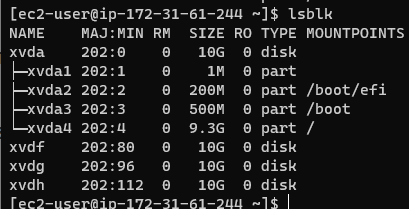
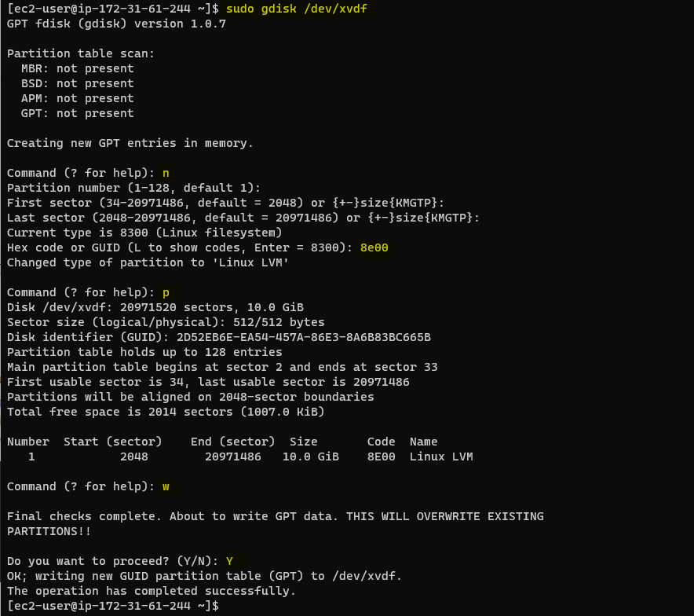
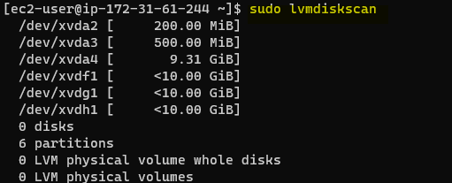
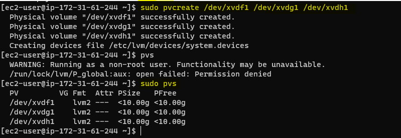
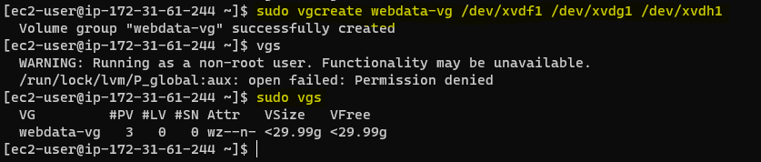
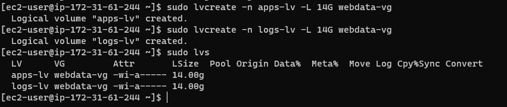
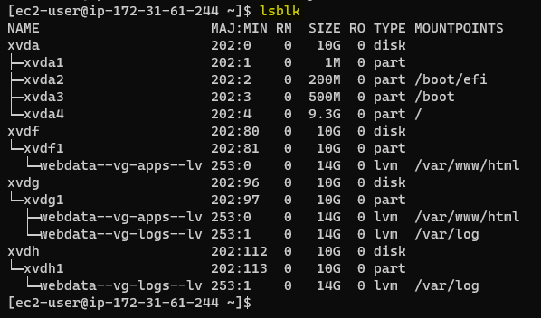
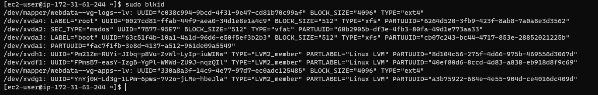
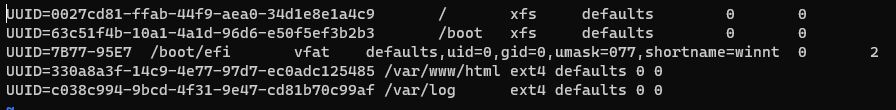

## **3-Tier ARCHITECTURE WITH WORDPRESS**

In this project we will be creating an infrastructure of an Apache web server, a mysql DB and an access point or browser.

We will be using RedHat OS and not the popular ubuntu. Here, 2 ECS instances will be created and 3 storage volumes. We will attach 3 volumes to each of the EC2 instances and use the logical volume manager.

 **A --SETTING UP THE ATTACHED STORAGE WITH LVM**

1. We launch 2 EC2 instances one will act as a web server while the other will act as a DB server

2. For each of the instances we will create 3 volumes with 10gig size and attached them (3 each) to the EC2 instance.

3. After we create our 2 instances, and create our 6 volumes (the instance and volume to be attached should be in the same availability zone) we will attach 3 volumes to 1 instance

    `Sudo lsblk --  show the list of storage block`



4. After attaching the volumes to the instances, we need to look into the logical volume management (LVM)

5. To use a Logical volume management (LVM)
    
    - we want to first create a partition on the physical disk
    - then we switch to logical volume management
    - with the LVM tool we create a physical volume, volume group, then a logical volume.

6. Let us create a partition first by using the code below

    `sudo gdisk /dev/xvdf`

7. Enter n ---- for new partition

8. Click enter to carry on the default configuration or enter values based on what partition number and first/last sector you want.

    - we change the file type to Logical olume management by inputting 8e00.
    - enter command p --- to see the partitions one have in a storage
    - enter command w to write into existing partition.



9. We will do the same for xvdf, xvdg, xvdh 

10. After running the partition on the attached volumes, we use lsblk to check the block devices and partitions.


11. Next we install Logical Volume Management (LVM) by running the below

    `sudo yum install lvm2`

12. Then run sudo lvmdiskscan to check for partition in the system.

    `sudo lvmdiskscan`




13. we cannot create physical volume directly on the physical disk .i.e xvdf or xvdg or xvdh but in the partitions. So we do the below

    `pvcreate /dev/xvdf1 /dev/xvdg1 /dev/xvdh1 ----  creates physical volume on the 3 partitions`



`sudo pvs`  --- shows the physical volumes we have

14. Next we create our volume group.

    `sudo vgcreate "name of volume group" /dev/xvdf1 /dev/xvdg1 /dev/xvdh1`




`sudo vgs` --- shows the volume group combined into one

15. Next we create our logical volume by using lvcreate utility to create 2 logical volumes. apps-lv (Use half of the PV size), and logs-lv Use the remaining space of the PV size. NOTE: apps-lv will be used to store data for the Website while, logs-lv will be used to store data for logs.

    `sudo lvcreate -n apps-lv -L 14G webdata-vg`

    `sudo lvcreate -n logs-lv -L 14G webdata-vg`





16. Next, we will format the logical volumes with ext4 filesystem. The mkfs command is used to make a file system on a device, usually a partition on a hard disk drive (HDD), or it can also be a USB drive, etc. Specifies the type of file system to be built. If not specified, the default file system type (currently ext2) is used.

    `sudo mkfs -t ext4 /dev/webdata-vg/apps-lv `

    `sudo mkfs -t ext4 /dev/webdata-vg/logs-lv`

17. We will create /var/www/html directory to store website files

    `sudo mkdir -p /var/www/html`

18. We will create /home/recovery/logs to store backup of log data

    `sudo mkdir -p /home/recovery/logs`

19. Now we mount our logical volumes on the created directories. when you mount, please confirm if there is an item on the child directory. on mounting, if there is an item init, the item gets deleted.

20. Now, because we want to mount on /var/log, we will move the log files (parent/ child files or folders) into /home/recovery/logs. If we mount without removing the files, they will be deleted. To do this we will use the rsync command.

    - rsync (remote sync) is the most commonly used command for copying and synchronizing files and directories remotely as well as locally.

`sudo rsync -av /var/log/. /home/recovery/logs`

21. Then we mount the logical volume to the /var/log directory

    `sudo mount /dev/webdata-vg/logs-lv /var/log`

22. Next we restore the copied log files back into /var/log

    `sudo rsync -av /home/recovery/logs/. /var/log`

23. After mounting the logical volumes, if we restart the system or instance, it will get deleted. To make our configuration persist even after reboot we add the block Id... to the fstab config file

    `sudo blkid  --- this will get the block Ids we have`



`vi /etc/fstab  ---- to add our mounted logical volumes as shown above`



24. To test it all went okay we run the below code and reload the daemon

`sudo mount -a`

`sudo systemctl daemon-reload`

25. To confirm what we have done we run the lsblk command to show the logical volumes and its mount point and type


**B --SETTING UP THE WEB AND DB SERVER FOR WORDPRESS**

1. Next, we install wordpress on our web server system

    `sudo yum -y update`

2. Install wget, Apache and its dependencies

    `sudo yum -y install wget httpd php php-mysqlnd php-fpm php-json`

3. we start Apache

    `sudo systemctl enable httpd`

    `sudo systemctl start httpd`

4. We install PHP and its dependencies

````
    sudo yum install https://dl.fedoraproject.org/pub/epel/epel-release-latest-8.noarch.rpm
    sudo yum install yum-utils http://rpms.remirepo.net/enterprise/remi-release-8.rpm
    sudo yum module list php
    sudo yum module reset php
    sudo yum module enable php:remi-7.4
    sudo yum install php php-opcache php-gd php-curl php-mysqlnd
    sudo systemctl start php-fpm
    sudo systemctl enable php-fpm
    sudo setsebool -P httpd_execmem 1

````

5. We restart Apache

    `sudo systemctl restart httpd`

6. Download wordpress and copy wordpress to var/www/html

````
    mkdir wordpress
	cd wordpress 
	sudo wget http://wordpress.org/latest.tar.gz
	sudo tar xzvf latest.tar.gz
	sudo rm -rf latest.tar.gz
    sudo cp -R wp-config-sample.php wp-config.php
  	sudo cp -R wordpress/.  /var/www/html/

````

7. Install mysql-server on both instances.(web server and db server)

    ````
    sudo yum install mysql-server -y
	sudo systemctl start mysqld
	sudo systemctl enable mysqld

    ````

8. configure DB to work with wordpress

````
    sudo mysql
	CREATE DATABASE wordpress;
	CREATE USER `myuser`@`172.31.61.244` IDENTIFIED BY 'mypass';
	GRANT ALL ON wordpress.* TO 'myuser'@'172.31.61.244';
	FLUSH PRIVILEGES;
	Show databases;

````


`select user, host from mysql.user` --- show you a table of users and it host


9. we set the binding address

    `we set the binding address`

10. Add the bind-address=0.0.0.0 (this gives access to anyone, its advisable to use a private ip). Then we restart the service mysqld

    `sudo systemctl restart mysqld`

11. We edit the wp-config.php in the web server instance and add the database name, username, password and host.

    `sudo vi wp-config.php`

12. Disable the default page of apache on the web server.

    `sudo mv /etc/httpd/conf.d/welcome.conf /etc/httpd/conf.d/welcome.conf_backup`

13. To confirm our web server can connect to our DB, we use this command connecting to the private IP of the DB

    `sudo mysql -u myuser -p -h 172.31.13.213`


14. When we look at the wordpress files, we will see that its all owned by “root”, hence apache will not have the access to use it. See below image


15. To fix this we change owner to apache

    `sudo chown -R apache:apache /var/www/html/`

16. Now the owner/group is apache


17. Next we configure SELinux policies

````
    sudo chcon -t httpd_sys_rw_content_t /var/www/html -R
  	sudo setsebool -P httpd_can_network_connect=1
	sudo setsebool -P httpd_can_network_connect_db 1

````

18. Lastly, we go to the browser, paste our web server public IP and we will see the word press welcome page to install wordpress


